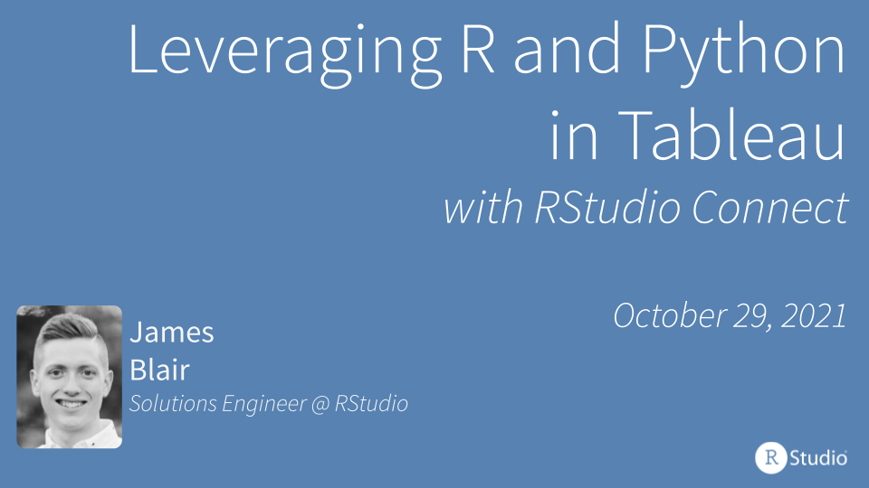

# RStudio and Tableau Webinar

This webinar highlights the integration between RStudio Connect and Tableau
using the Tableau Analytics Extensions API. Examples covered in this webinar
can be found [here](https://github.com/sol-eng/tableau-examples).

